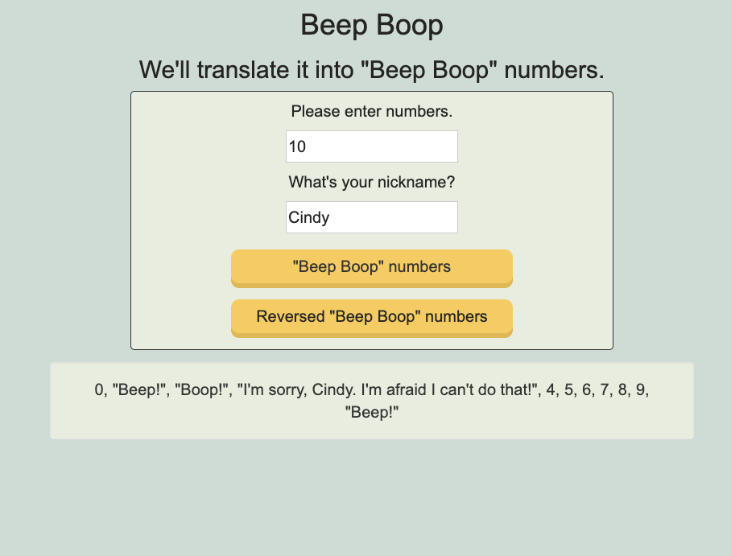

# _Roman Numerals_

#### _week 3 solo project: a Beep Boop application, 8/23/2019_

## Description
Build a Beep Boop application (using HTML, CSS, JavaScript and jQuery)

Create a web application that takes a number from a user and returns a range of numbers from 0 to the user inputted number with the following exceptions:

* Numbers that contain a 1: all digits are replaced (all digits) with "Beep!"
* Numbers that contain a 2: all digits are replaced (all digits) with "Boop!"
* Numbers that contain a 3: all digits are replaced (all digits) with "I'm sorry, Dave. I'm afraid I can't do that."

These exceptions are written from least to most important. The first exception should apply unless the second exception does, and the same with the second and third. So, for example, in your finished program,

* The number 13 should be replaced with "I'm sorry, Dave. I'm afraid I can't do that."
* The number 21 should be replaced with "Boop".
* The number 32 should be replaced with "I'm sorry, Dave. I'm afraid I can't do that."

A user should be able to enter a new number and see new results over and over again.

## Website should have:
This project should be created based on BDD and the separation logic of Business logic and User Interface logic.

### Specs

Here is the individual behaviors with input/output examples.

- **Spec**: The program returns an error message when user input except numbers
    - **Input**: ''
    - **Output**: 'Please input integers!'

- **Spec**: The program returns a range of numbers from 0 to the users inputted number
    - **Input**: '4'
    - **Output**: `0, 1, 2, 3, 4`

- **Spec**: The program returns a range of numbers from 0 and returns "Beep!" when it contains a 1, returns "Boop!" when it contains a 2, and returns a message when it contains a 3.
    - **Input**: '4'
    - **Output**: `0, "Beep!", "Boop", "I'm sorry, Dave. I'm afraid I can't do that.", 4`

- **Spec**: When it's more than one digits and contains 1, 2 or 3 as a first digit, it returns a range of numbers from 0 and returns "Beep!", "Boop!" or a message based on the first digit
    - **Input**: '13'
    - **Output**: `0, "Beep!", "Boop", "I'm sorry, Dave. I'm afraid I can't do that.", ..."Beep!"`

- **Spec**: When it's more than one digits and second or third digit contains 1, 2 or 3, it returns a range of numbers from 0 and returns "Beep!", "Boop!" or a message based on the second or third digit.
    - **Input**: '41'
    - **Output**: `0, "Beep!", "Boop", ..., 40, "Beep!"`

- **Spec**: When user click a reversed button, the order would be reversed.
    - **Input**: '4'
    - **Output**: `4, "I'm sorry, Dave. I'm afraid I can't do that.", "Boop", "Beep", 0`

## Setup/Installation Requirements
* Clone this repo:
`$git clone https://github.com/misakimichy/beep-boop.git`

* Navigate to the top level of the cloned directory.
* Then, open your preferred web browser.

## Known Bugs
* Work in progress.

## Support and contact details
 misaki.koonce@gmail.com

## Technologies Used
_Git GitHub  HTML CSS Bootstrap jQuery JavaScript and VSCode 

## License
Copyright (c) 2019 under the MIT License